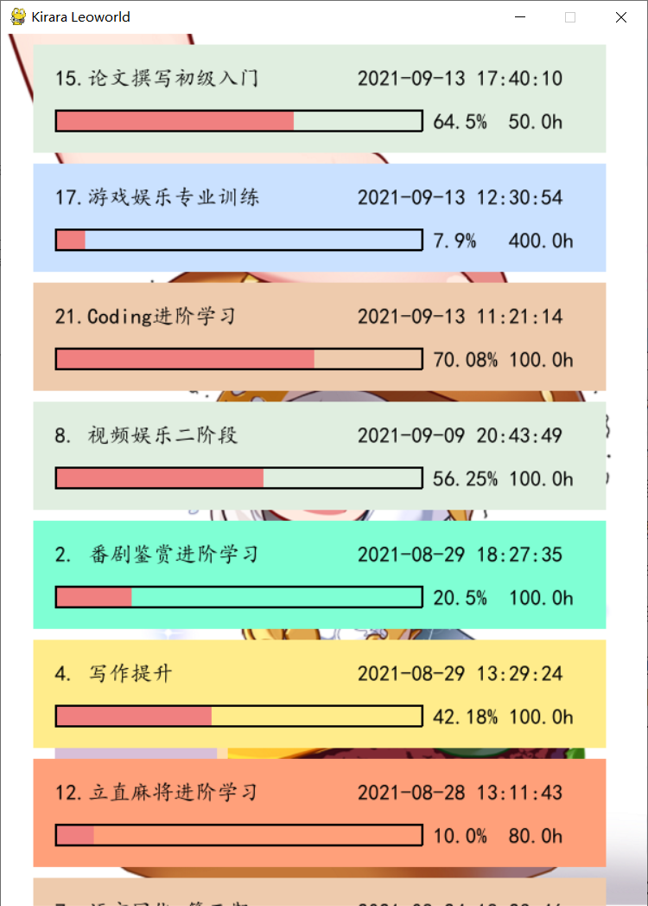
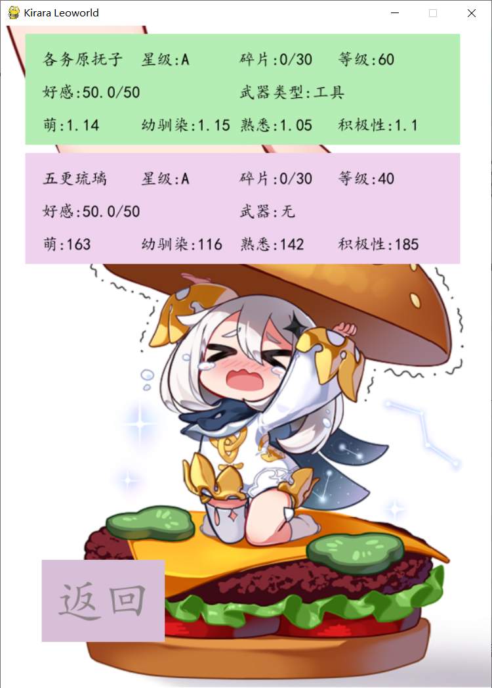
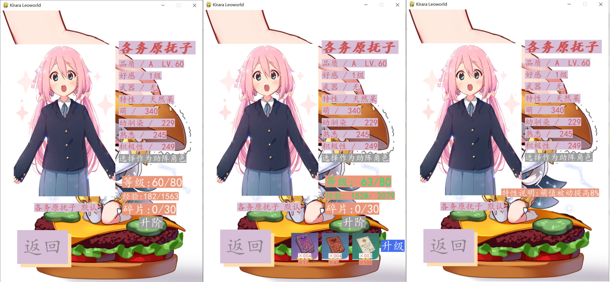
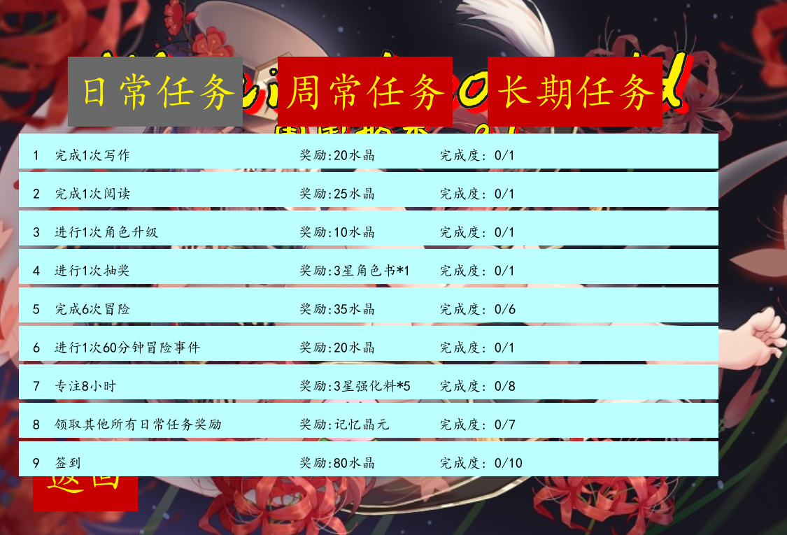

# 使用描述/Usage

由于本软件基本自用，改动较为频繁，没有通过`pyinstaller`打包，使用时可以通过点击`Kirara Leoworld.bat`或`Kirara Leoworld - debug.bat`运行程序。其中`debug`模式会保留cmd窗口，以便调试，`Kirara Leoworld.bat`会在打开后关闭黑窗，不会保留窗口。

## 依赖

```python
mysqlclient 2.0.1
pip         21.2.4
psutil      5.7.3
pygame      2.0.1
pypiwin32   223
pywin32     228
setuptools  49.2.1
wheel       0.35.1
win10toast  0.9
```

其中对`win10toast`进行了魔改，为win10的弹窗生命周期增加了`destroy by me`选项，文件放在 changed_site-package 文件夹下。

需要安装 mysql，并开启对应服务。

## 主页面


主页面可以选择女武神（当前已经抽取角色）、助：xxx（助战女武神）、抽卡（抽取升级材料、角色）、背包（查看拥有的材料）、新的冒险（主要功能，进入冒险列表）、签到（每日三个对应时间点签到）、角色列表（查看当前所有角色）。

## 冒险



点击新的冒险后，点击对应事件可以选择投入时间的时间，时间可以选择50（一个番茄钟）、60（爱好培养）、25（半个番茄钟）、10（休息时间）等四个时间段，不同时间段结束的冒险奖励和助战角色好感度提升会不同。

## 角色



点击角色，会显示自己抽到的角色列表，点击其中的角色会显示为绿色并显示武器类型、四维属性提升系数等。



点击该角色进入后，会显示该角色信息，通过点击品质、武器、特性、选择进行助阵角色等进行角色升级升阶、武器选择、特性查看、上场下场助阵角色等操作。

## 任务



添加日常任务、周常任务、长期任务，其中日常任务在每天凌晨4点刷新，周常任务在周一凌晨4点刷新，在完成对应的任务时可以领取相应奖励。

## 背包


首页背包系统可以查看自己拥有的武器和材料等情况。

# Kirara Leoworld

## 202111xx 雪霁梅香 V2.1正式版

更新的V2.1，计划加入武器系统、背包系统、任务系统、商城系统。

1. 任务系统加入日常任务、周常任务、版本任务、年度任务作为激励。

2. 武器突破将对武器的额外加成值进行改动，不再采用角色的数值型增长系统，而是对特效进行增长。武器类型从之前的六个现实类型转向五大类型向靠齐。

3. 商城系统，上架记忆晶元、水晶等材料购买入口。

4. 《珈百璃的堕落》正式上线，天真·珈百璃加入KL，拥有武器升级经验加成的特殊能力——**天使宅女**，是一个辅助定位的角色。

5. ```python
   #临时
   def countdown(screen, option, small_bg):
       duration_minutes_list = [50, 60, 25, 2]            最后一个
       a_minute_coeffi = 1                                一分钟具有多少秒系数
   ```

6. 为角色添加精力值系统。

## 20210816 V2.0正式版

今天更新V2.0，加入了一系列RPG元素，主要增加的机制和玩法如下：

1. 新增女武神机制，不同女武神的特性和四维属性不同，四维可以对好感度、完成冒险的水晶、完成冒险获取的高品质材料获得产生影响。不同皮肤的女武神拥有不同插画。
2. 动画大幅更新，为多处按钮添加按钮效果，优化显示效果。
3. 抽奖机制更新，现在可以通过抽卡获取新的女武神以及强化材料。
4. 修改数据库时，可以通过`truncate table `表明让自增id重新计数。

设计过程中参考了很多优秀的游戏，该主要开发时间在一周左右，其中肯定还有不完美的地方，但是在开发过程中对页面刷新、文字与矩形框绑定、按钮点击等等机制有了更加深刻的理解，在合并branch时顺便复习了git的部分命令，开发过程辛苦，8.13-8.16这几天晚上写功能、页面、改bug经常到一两点，也因此开发完成后的喜悦更甚。

伴随V2.0正式版更新，奖励自己30连抽的水晶。

## 斯金纳箱

因为很喜欢之前一个up介绍的关于斯金纳箱的观点，他把这个观点用在游戏中，我就想能不能给自己制作一个斯金纳箱，可以和**番茄工作法**结合起来。

于是用了几个小时简单设计了一下，今天花了半天时间完成了lottery模块，因为一开始没注意到这个页面其实是在不断刷新的（没错，就是忽视了藏在其中的pygame.display.flip()函数），走了一些弯路，不过意识到之后写起来简单多了。

## 初心

*2019/10/07 月曜日：*这原本是我准备用pygame练手用的一个，建立类似芳文社Kirara的横版游戏的一个软件，其中存储一些我很喜欢的二次元女孩子的信息，以及武器等等，2019年国庆假期的时候写的，大概花了三天时间学习加写完figure、weapon、work几个页面，发现战斗流程太复杂了，就没有实现，只是做了一个类似番剧数据库的玩意。

目前番剧数据库功能已被bangumi代替（2020.08.23），**本应用全面转型为一个简单的服务于个人的生产力工具**。

*2021/6/9添加：*10000h定律，指一个人想在某个领域达到顶尖水平需要练习的时间，这也代表每天练习3小时需要连续不断地练习10年，人生中有几个十年可供专心做一件事呢？

据此我依靠现有的知识，将对一件新事件的学习时间分配为2000小时，每天3h养成，如果达到2000H的练习，我就认为在这一领域达到了相当了解的水平了。毕竟我玩游戏也很少能有连续玩两年的游戏，更不知道这个番茄钟的生命周期是多少了，不过从19年国庆节断断续续到现在也有近两年了，居然还没有放弃我也挺讶异的，毕竟我还算一个毕竟容易半途而废的人。

成就规则设置如下：

1. xxx初级入门 40-50H=2400-3000min
2. xxx进阶学习 100H=6000min
3. xxx高级能力 200H=12000min
4. xxx专业训练 400H=24000min
5. xxx领域养成 1250H=75000min

题外话，个人相信**天赋>努力**的说法，因此“如果对于尚未入门的人来说，努力仍然是毫无疑问十分值得的，但是假如在某个领域已经入门并明显停滞，那么不妨立刻停止努力，把精力转移到其他领域，寻找更多可能。归根结底，我们一定要清楚地寻找自己的天赋和特长，远比闷头努力重要一万倍。”

---

***内部美术素材来自：原神、崩坏3、Pixiv、炉石传说。（侵权联系作者删除）***

## 水晶使用情况描述

0. KL水晶Cys和现实RMB兑换比例为10:1
1. 每日入场KL世界花销水晶1500氵
2. 每日夜间/晨间盘点当日/前日账单并计入番茄日り文档
3. KL钱包由水晶兑换使用，如果无法完成基本签到，每日消费限额10RMB
4. 项目名和常用水晶赚取消费情况如下：

|             项目名称              | 水晶变动            | 备注                     |
| :-------------------------------: | ------------------- | ------------------------ |
|              兑换RMB              | 10Cys -> 1RMB       |                          |
|             工作日常              | 一个完整钟220Cys    |                          |
|     看书/整理书/写作/爱好培养     | 一个完整钟260Cys    |                          |
|     看娱乐视频/电子游戏/看番      | 10min -> 5Cys       |                          |
|          工程娱乐/Coding          | 半个番茄钟90Cys     |                          |
|       完成一个大于20h的事件       | 时间$\times$0.75Cys |                          |
|    较完整看完一部番并写完感想     | 600Cys              | 消耗时间需超过120min     |
|    较完整看完一本书并整理完成     | 500Cys              | 页数需超过60page         |
| 较完整看完一部剧集/游戏并写完感想 | 400Cys              | 消耗时间需超过120min     |
|   完成一道编程题 简单/中等/困难   | 20/40/80Cys         | 独立完成、查漏补缺并记录 |
|                                   |                     |                          |
|                                   |                     |                          |
|                                   |                     |                          |

## 20210628 v1.2补丁

鉴于内部功能的优化已经到了一定地步，将版本号升级为v1.2，本次更新所带来的新特性主要为：

1. 页面UI的更新。
2. 针对之前体验的bug做了修复；对体验进行了升级。

## 20201218 v1.1补丁

本次更新在恋爱后18天写下，第一期计划从2020/10/27-2020/12/18共持续53天，效果开始还较为显著，但是越到后面就越是拖沓，导致自己完全没有心思去继续完成番茄钟。在这样的背景下，本次v1.1补丁对上一期中所发现的一些痛点进行改动。

1. 针对每日完成工作量较少的情况，将每日入场料收取费用改为1000氵。
2. 修改封面图，并加入版本号。
3. 对1400+RMB的欠款，采取相应策略进行激励：
   1. 每日早起签到奖励修改为3*80。
   2. 修改娱乐时间20min选项为休息10min，以增加番茄钟的连续性，水晶奖励相应减少一半。
   3. 新增LeeCode刷题水晶赚取方式。

## 未来工作计划

- [ ] 抽卡部分动画实现，视频or多张图片连接实现动画or库里的反转效果？
- [x] RPG元素加入的大计划
- [x] 可以的话实现read_achievements()函数的按钮效果
- [ ] 完善武器、圣痕机制
- [ ] 添加商城系统
- [ ] 添加任务/成就机制

## v2.1 开发日志

### 2021/11/25 木曜日

完成了knapsack背包的显示和点击交互操作。

### 2021/11/11 木曜日

1. 在写任务系统的时候发现mysql的一个问题，如果选择的类型是float或double，长度为11（int默认为11，转过来后没有修改）的话，是无法存入小数的，改成0才解决这个问题。
2. 两天时间，从设计到完成整个任务系统。写任务逻辑的时候真快乐啊


## v2.0 开发日志

### 2021/8/16 月曜日

1. 冒险结束后根据四维属性增加好感度、水晶加成、高品质材料掉落。
2. 完善所有V2.0所有角色特性。
3. **规范完善主函数注释**。

### 2021/8/15 日曜日

1. 女武神显示页面，增加点击经验、技能、好感按钮显示。
2. **完成角色升阶，角色升级功能。**
3. 对通用公式查询formula文件的注释进行了规范。
4. **完成选中女武神显示页面 - 角色书、升级、四维属性。**
5. 发现一个bug，在A.py中update数据库内容，db.commit()后在A.py数据库query可以正确查询到，但是在B.py中相同的代码就查不到最新的了，还保留之前的数据，是不是和缓存有关？（没错说的就是你query_current_assist_girl()）
6. 主页面原作品栏现在修改为正在助战女武神。

### 2021/8/14 土曜日

1. 优化页面显示代码，将文字和与之绑定的矩形分离，提高复用性。
2. 添加角色抽奖up池功能，在获得5星传说角色时，有40%的概率直接命中up角色。
3. 抽奖结果文字居中显示。
4. **初步完成选中女武神显示页面 - 现有等级、升阶、好感度、特性显示。**

### 2021/8/13 金曜日

1. **完成角色、武器、日志、背包数据库设计，并完善初始数据。**
2. **完成角色抽奖模块，添加77次的传说保底机制。**
3. log转入数据库进行记录，弃用之前的文件记录。

### 2021/7/6 火曜日

1. 设计v2.0全面更新，增加RPG元素，分离单独的开发版，向未来工作计划迈进。
2. 拆分update_screen - typed各功能为单独函数，大幅提高代码复用性、简洁性。
3. 冒险结束后可以显示增加的进度条

## v1.2更新日志

### 2021/7/4 日曜日

1. update_screen - achievement中的倒计时模块化，优化代码。
2. 在阅读完心流后，将爱好培养修改为1小时 - 260Cys。

### 2021/7/3 土曜日

规范了倒计时均为两个数字显示，为结束一项活动的页面增加了文字信息。

### 2021/7/2 金曜日

为成就页面增加按顺序换色的背景，初始挑选了7个觉得舒服的颜色。

### 2021/6/28 月曜日

1. 现在在选择成就事件页面可以看到选中的事件了，避免选错。只是在点击一次后由于刷新率的缘故会消失一下，不过觉得挺好玩认为这是特性而不是bug了。
2. 增加了第三期背景图

### 2021/6/26 土曜日

1. 修复了成就页面可以向上滚动一次的bug。
2. 添加了总时间，放在主页面中。

### 2021/6/25 金曜日

成就列表按照上次打开时间排序，更加符合实际情况，不用一直向下翻找常用的了。

### 2021/6/22 火曜日

1. 添加每日登陆的日志文件记录，可以正确为每一天添加换行了，而不是按照收取入场费的顺序。
2. 添加了多张大小图片。

### 2021/6/16 水曜日

1. 还是用新函数减少了update_screen - lottery代码。
2. 发现一个特性，pygame.event.get()的鼠标点击生命周期在跳出循环的时候自动会为pygame.MOUSEBUTTONDOWN添加一个pygame.MOUSEBUTTONUP。因此在操作的时候只能在该循环内进行操作。
3. 完成大于20h事件的水晶奖励由800Cys更改为（时间分钟$\times$0.75）取正。
4. 为主页面和click_button_achievement()中的button增加按钮点击效果。

## v.1.1更新日志

### 2020/11/17 火曜日

增加每日入场料收取延时，从凌晨4点开始计算后一天的入场料收取。

### 2020/11/06 金曜日

根据201022日重写的win10toast，将抽奖、签到、入场料收取等环节全部改成destroy by me模型，优化程序卡顿问题。

### 2020/10/28 水曜日

修改kirara_mean.py 为程序增加鉴别自己是否在运行功能，通过检测目前已经在运行的pythonw.exe不超过两个实现，系统本身会存在一个。

### 2020/10/23 金曜日

为主窗口增加到8张可以轮换的背景图，通过按h、l进行左右切换。

### 2020/10/22 木曜日

感觉现在颇有每天写一个小功能，然后100天之后变成一个完善生产力工具的趋势~

1. 新增入场料收取功能，每日入场费用暂定为1500氵，登录即收取。
2. 使用duration_minutes增加专注时间改动时的复用性，优化代码。
3. 新增专注时间小窗口背景图随机选择。初始14张图，暂定500氵换一张新的。
4. 改写Python\Lib\site-packages\win10toast\__init__.py文件，增加根据自己需要关闭win10toaster的功能。
5. 主页面增加标题，改动按钮位置不挡住封面妹子的脸。

### 2020/10/21 水曜日

缩短休息时间为20min（原本为30min），为achievement选择页面新增加id用来确认自己完成的事件数目。

### 2020/10/20 火曜日

*增加背景图三张*，分别对应通用页面大图一张，小页面两张，现在比较深刻地认识到，功能开发成什么样子对体验的提升远远不如更换一个更好看的ui来得重要。

在实体类中新增Settingssmallwindow()类，用来统一设置小窗口的属性。

### 2020/10/19 月曜日

*增加全新功能——时间投入事件*，在专注之前首先选择事件，源自一句话：**<font color='Crimson'>很多东西即使你用再巧妙的技巧也需要时间去磨。</font>**同时方便自己查看投入时间，而不是仅仅只通过水晶来衡量。开发用时4小时。

*增加了FPS设置*，而不是之前的延时1s，这样更有助于控制刷新频率。

### 2020/08/22 土曜日

修改抽卡次数为水晶机制，280氵一次，同时对完成不同工作和签到可获得的水晶数量进行了更加合理的改动；update_screen的lottery部分优化冗余代码。

### 2020/08/19 水曜日

增加了早午夜时间段签到功能，用于合理规划自己的时间。

### 2020/08/17 月曜日

增加了倒计时的番茄计时功能，在完成后写入日志并以气泡通知。利用pyinstaller打包成可执行文件。

### 2020/08/16 日曜日

用了几个小时简单设计了一下斯金纳箱，今天花了半天时间完成了lottery模块，因为一开始没注意到这个页面其实是在不断刷新的（没错，就是忽视了藏在其中的pygame.display.flip()函数），走了一些弯路，不过意识到之后写起来简单多了。


